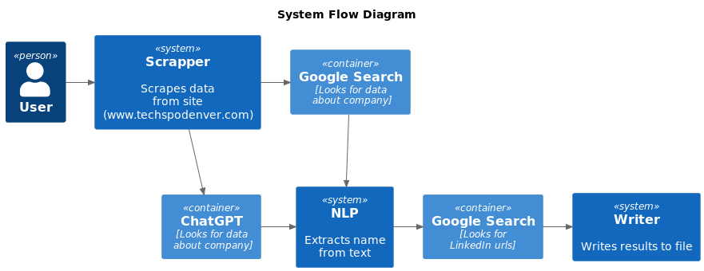

# exhibitors-scrapper
A tiny scrapper of techspodenver.com with feature to search for more data about companies, using ChatGPT

## Architecture


## Setup and Run

### Setup
- Install Python 3.8 or later
- Install project dependencies:
```bash
pip install -r requirements.txt
```

### Run
- Set environment variables in .env file
- Run scrapper:
```bash
python main.py
```

After getting results, you can import exhibitors.csv file in Google Spreadsheet